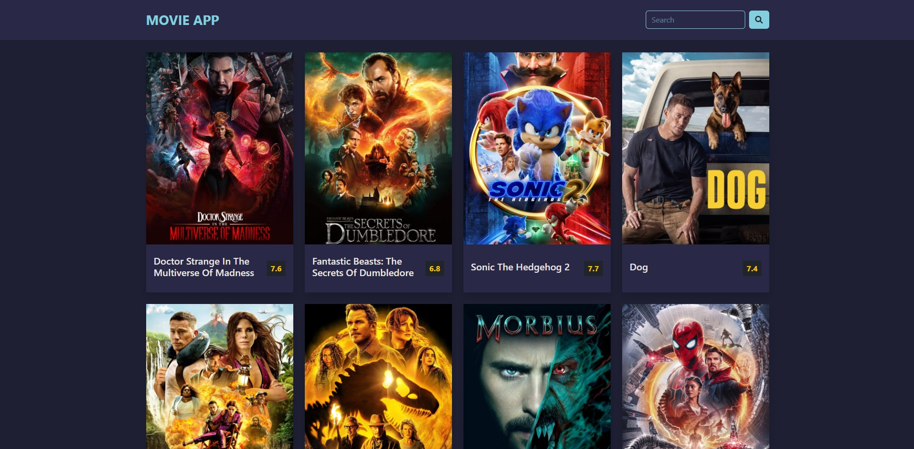

# MOVIE APP

search any movies you want


## LICENSCE

[](https://github.com/tterb/atomic-design-ui/blob/master/LICENSEs)

## DEMO

click [here](https://kawsersimanto.github.io/movie-app/)
## FEATURES

- ```API based```
- ```responsive```


## TECHNOLOGIES USED

```Client: HTML5, CSS3, BOOTSTRAP, JS```


## Screenshots




## AUTHOR

[@kawsersimanto](https://www.github.com/kawsersimanto)

